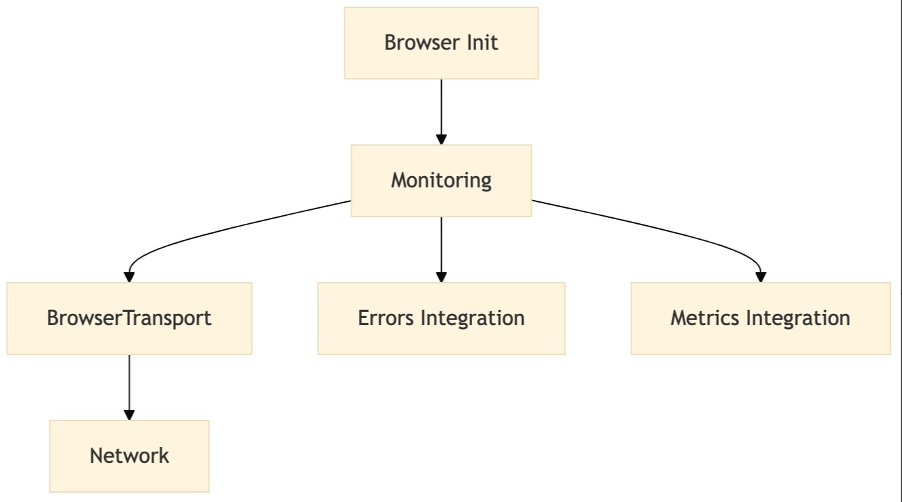

· 【初中级】面试官：你们前端项目的整体稳定性是怎么保证的？异常和性能的监控SDK内核如何实现？
· 【中高级】面试官：有了解过完整监控平台从指标到可视化全链路体系吗？大型实时数据流日志系统怎么设计？
· 【专家级】面试官：请详细介绍一下你们团队前端监控平台的全栈流程设计与实践，要考虑巨量数据流量及存储处理细节

前端初中级、高级、专家面试，最大的区别在于工程化、构建、架构等方面的考察，如果不精进这几部分内容，面试很难与竞争者拉开差距。很多同学现在的项目实在是太简单，很多同学认为前端根本接触不到业务，工作中也不怎么可以去提升业务认知，久而久之核心竞争力就愈发欠缺。
面试一个重要核心点就是：“借势”，三流项目能说出二流的感觉，市面上厉害的产品能抽取架构方案与最佳实践为己所用。
就比如本项目：监控平台，很多同学可能连前端SDK的基本实现都不清楚，更谈不上全链路设计，这是你的短板，补足它就能补充你的项目重难点。
· 性能异常指标采集与用户行为手动埋点SDK方案设计
· 基于monorepo项目全栈架构设计与最佳实践
· 实时数据流与日志系统经典架构设计：kafka、clickhouse 

【初中级】你们前端项目的整体稳定性是怎么保证的？异常和性能的监控SDK内核如何实现？

我们详细介绍了性能优化相关指标概念，这次我们来结合大厂监控平台实战，充分理解指标定义、计算与上报逻辑。前端性能监控通过收集和分析用户端的性能数据来衡量和优化页面加载速度、交互响应时间等关键性能指标的过程。

为什么需要性能监控？
· 提升用户体验：减少页面加载和响应时间，提高用户留存率。
· 发现和优化性能瓶颈：及时发现影响性能的因素并进行优化。
· 数据驱动决策：基于真实数据进行性能优化，而非依赖直觉。 

性能指标与采集
常见的性能指标
核心性能指标
加载性能
1. FP (First Paint) - 首次绘制
    - 定义：页面任何像素被渲染所花费的时间。
    - 评估工具：Chrome DevTools Performance 面板。
2. FCP (First Contentful Paint) - 首次内容绘制
    - 定义：页面开始渲染任何文本、图片、SVG 的时间。
    - 评估工具：Performance 面板、web - vitals 或 Lighthouse。
3. LCP (Largest Contentful Paint) - 最大内容绘制
    - 定义：页面中最大的文本块或图片呈现所花费的时间。
    - 理想值：< 2.5秒。
4. TTFB (Time to First Byte) - 首字节到达时间
    - 定义：用户发起请求到接收服务器响应第一个字节的时间。
    - 评估工具：Network 面板。 
  
交互性能
1. INP (Interaction to Next Paint) - 交互到下一次绘制
  - 定义：用户交互（如点击按钮）到界面响应的时间。
  - 理想值：< 200ms。
2. TBT (Total Blocking Time) - 总阻塞时间
  - 定义：从FCP到TTI (Time to Interactive) 之间，主线程被阻塞的时间总和。
  - 理想值：< 200ms。
3. CLS (Cumulative Layout Shift) - 累计布局偏移
  - 定义：页面意外的布局移动得分，影响用户体验。
  - 理想值：< 0.1。

补充性能指标
1. DNS查询时间
  - 定义：从发起请求到DNS查询完成的时间。
  - 评估工具：Network面板。
2. 资源加载时间
  - 定义：所有静态资源（如图片、CSS、JS）的下载时长。
3. 长任务（Long Task）
  - 定义：主线程运行超过50ms的任务。 

性能指标定义与获取
4. 开发阶段工具
  - Chrome DevTools: Performance面板用于捕获FP、FCP、LCP等指标。
  - Lighthouse: 生成页面性能报告，提供优化建议。
  - web-vitals: 监控FCP、LCP、CLS等核心Web Vitals指标。
5. 生产环境监控
  - 前端性能监控工具:
    - Google Analytics: 配置自定义事件记录指标。
    - Web Performance API: 直接从浏览器获取性能数据。

```js
const { timing } = performance;
console.log('TTFB:', timing.responseStart - timing.requestStart);
```
  - 性能监控平台:
    - 使用开源平台（如Prometheus + Grafana）或第三方服务（如New Relic、Datadog）。
6. 用户行为数据
  - 埋点记录页面加载时间、交互延迟等关键性能指标，结合用户行为分析优化方向。 

原始采集
指标计算（客户端采集）
通过Performance API和web-vitals库采集核心指标：

```js
import { getLCP, getCLS, getINP } from 'web-vitals';
// 采集 LCP
getLCP((metric) => {
  console.log('LCP:', metric.value);
  reportMetricToServer('lcp', metric.value);
});
// 采集 CLS
getCLS((metric) => {
  console.log('CLS:', metric.value);
  reportMetricToServer('cls', metric.value);
});
// 采集 INP
getINP((metric) => {
  console.log('INP:', metric.value);
  reportMetricToServer('inp', metric.value);
});
// 上报指标
function reportMetricToServer(name, value) {
  fetch('/api/report-metric', {
    method: 'POST',
    headers: { 'Content-Type': 'application/json' },
    body: JSON.stringify({ name, value, timestamp: Date.now() }),
  });
}
```

此外，还可以通过 PerformanceObserver 捕获更细粒度的指标（如LCP、CLS的变化过程）。

### 首屏性能相关
#### TTFB (Time to First Byte)
获取首字节到达时间：

```js
const { timing } = performance;
const ttf = timing.responseStart - timing.requestStart;
console.log('TTFB:', ttf, 'ms');
```
#### FP (First Paint)和FCP (First Contentful Paint)
通过 PerformancePaintTiming 获取：

```js
const paintEntries = performance.getEntriesByType('paint');
paintEntries.forEach((entry) => {
  console.log(
  `${entry.name}: ${entry.startTime} ms
  );
});
// 输出:
// First Paint: xxx ms
// First Contentful Paint: xxx ms
``` 

### LCP (Largest Contentful Paint)
通过 PerformanceObserver 获取LCP：
代码块
```
const observer = new PerformanceObserver((list) => {
  const entries = list.getEntries();
  entries.forEach((entry) => {
    console.log('LCP:', entry.startTime,'ms');
  });
});
observer.observe({ type: 'largest-contentful-paint', buffered: 
```

### CLS (Cumulative Layout Shift)
通过 PerformanceObserver 监听CLS：

```js
let clsValue = 0;
const observer = new PerformanceObserver((list) => {
  list.getEntries().forEach((entry) => {
    if (!entry.hadRecentInput) {
      clsValue += entry.value;
    }
  });
});
observer.observe({ type: 'layout-shift', buffered: true });
window.addEventListener('beforeunload', () => {
  console.log('CLS:', clsValue);
});
```

### 交互性能相关
#### TBT (Total Blocking Time)
获取长任务：

```js
const observer = new PerformanceObserver((list) => {
  const longTasks = list.getEntries();
  longTasks.forEach((task) => {
    const blockingTime = task.duration - 50; // 超过50ms才算阻塞
    if (blockingTime > 0) {
      console.log('Blocking time:', blockingTime,'ms');
    }
  });
});
observer.observe({ type: 'longtask', buffered: true });
```

#### INP (Interaction to Next Paint)
监听用户交互并计算延迟时间：

```js
const observer = new PerformanceObserver((list) => {
  list.getEntries().forEach((entry) => {
    console.log('Interaction delay:', entry.processingStart - entry.startTime,'ms');
  });
});
observer.observe({ type: 'event', buffered: true });
``` 

### 拓展Web-vitals采集
#### FCP

```js
/*
 * Copyright 2020 Google LLC
 *
 * Licensed under the Apache License, Version 2.0 (the "License");
 * you may not use this file except in compliance with the License.
 * You may obtain a copy of the License at
 *
 *     https://www.apache.org/licenses/LICENSE-2.0
 *
 * Unless required by applicable law or agreed to in writing, software
 * distributed under the License is distributed on an "AS IS" BASIS,
 * WITHOUT WARRANTIES OR CONDITIONS OF ANY KIND, either express or implied.
 * See the License for the specific language governing permissions and
 * limitations under the License.
 */

import { onBFCacheRestore } from './lib/bfcache.js'
import { bindReporter } from './lib/bindReporter.js'
import { doubleRAF } from './lib/doubleRAF.js'
import { getActivationStart } from './lib/getActivationStart.js'
import { getVisibilityWatcher } from './lib/getVisibilityWatcher.js'
import { initMetric } from './lib/initMetric.js'
import { observe } from './lib/observe.js'
import { whenActivated } from './lib/whenActivated.js'
import { whenActivated } from './lib/whenActivated.js'
import { FCPMetric, MetricRatingThresholds, ReportOpts } from './types.js'

/** Thresholds for FCP. See https://web.dev/articles/fcp#what_is_a_good_fcp_score */
export const FCPThresholds: MetricRatingThresholds = [1800, 3000]

/**
 * Calculates the [FCP](https://web.dev/articles/fcp) value for the current page and
 * calls the `callback` function once the value is ready, along with the
 * relevant `paint` performance entry used to determine the value. The reported
 * value is a `DOMHighResTimeStamp`.
 */
export const onFCP = (onReport: (metric: FCPMetric) => void, opts?: ReportOpts) => {
    // Set defaults
    opts = opts || {}

    whenActivated(() => {
        const visibilityWatcher = getVisibilityWatcher()
        let metric = initMetric('FCP')
        let report: ReturnType<typeof bindReporter>

        const handleEntries = (entries: FCPMetric['entries']) => {
            entries.forEach(entry => {
                if (entry.name === 'first-contentful-paint') {
    po!.disconnect()

    // Only report if the page wasn't hidden prior to the first paint.
    if (entry.startTime < visibilityWatcher.firstHiddenTime) {
        // The activationStart reference is used because FCP should be
        // relative to page activation rather than navigation start
        // if the
        // page was prerendered. But in cases where `activationStart`
        // occurs
        // after the FCP, this time should be clamped at 0.
        metric.value = Math.max(entry.startTime -
            getActivationStart(), 0)
        metric.entries.push(entry)
        report(true)
    }
}
})
}
const po = observe('paint', handleEntries)
if (po) {
    report = bindReporter(onReport, metric, FCPThresholds,
        opts!.reportAllChanges)

    // Only report after a bfcache restore if the `PerformanceObserver`
    // successfully registered or the `paint` entry exists.
    onBFCacheRestore(event => {
        metric = initMetric('FCP')
        report = bindReporter(onReport, metric, FCPThresholds,
            opts!.reportAllChanges)

        doubleRAF(() => {
            metric.value = performance.now() - event.timeStamp
            report(true)
        })
    })
}
})
} 

``` 

### LCP

```ts
/*
 * Copyright 2020 Google LLC
 *
 * Licensed under the Apache License, Version 2.0 (the "License");
 * you may not use this file except in compliance with the License.
 * You may obtain a copy of the License at
 *
 *     https://www.apache.org/licenses/LICENSE-2.0
 *
 * Unless required by applicable law or agreed to in writing, software
 * distributed under the License is distributed on an "AS IS" BASIS,
 * WITHOUT WARRANTIES OR CONDITIONS OF ANY KIND, either express or implied.
 * See the License for the specific language governing permissions and
 * limitations under the License.
 */

import { onBFCacheRestore } from './lib/bfcache.js'
import { bindReporter } from './lib/bindReporter.js'
import { doubleRAF } from './lib/doubleRAF.js'
import { getActivationStart } from './lib/getActivationStart.js'
import { getVisibilityWatcher } from './lib/getVisibilityWatcher.js'
import { initMetric } from './lib/initMetric.js'
import { observe } from './lib/observe.js'
import { onHidden } from './lib/onHidden.js'
import { runOnce } from './lib/runOnce.js'
import { whenActivated } from './lib/whenActivated.js'
import { whenIdle } from './lib/whenIdle.js'
import { LCPMetric, MetricRatingThresholds, ReportOpts } from './types.js'

/** Thresholds for LCP. See https://web.dev/articles/lcp#what_is_a_good_lcp_score */
export const LCPThresholds: MetricRatingThresholds = [2500, 4000]

const reportedMetricIDs: Record<string, boolean> = {}

/**
 * Calculates the [LCP](https://web.dev/articles/lcp) value for the current page and
 * calls the `callback` function once the value is ready (along with the
 * relevant `largest-contentful-paint` performance entry used to determine the
 * value). The reported value is a `DOMHighResTimeStamp`.
 *
 * If the `reportAllChanges` configuration option is set to `true`, the
 * `callback` function will be called any time a new `largest-contentful-paint`
 * performance entry is dispatched, or once the final value of the metric has
 * been determined.
 */
export const onLCP = (onReport: (metric: LCPMetric) => void, opts?: ReportOpts) => {
    // Set defaults
    opts = opts || {}

    whenActivated(() => { 
        const visibilityWatcher = getVisibilityWatcher()
let metric = initMetric('LCP')
let report: ReturnType<typeof bindReporter>

const handleEntries = (entries: LCPMetric['entries']) => {
    // If reportAllChanges is set then call this function for each entry,
    // otherwise only consider the last one.
    if (!opts!.reportAllChanges) {
        entries = entries.slice(-1)
    }

    entries.forEach(entry => {
        // Only report if the page wasn't hidden prior to LCP.
        if (entry.startTime < visibilityWatcher.firstHiddenTime) {
            // The startTime attribute returns the value of the renderTime if
            // it is
            // not 0, and the value of the loadTime otherwise. The
            // activationStart
            // reference is used because LCP should be relative to page
            // activation
            // rather than navigation start if the page was prerendered. But
            // in cases
            // where `activationStart` occurs after the LCP, this time should
            // be
            // clamped at 0. 
            metric.value = Math.max(entry.startTime - getActivationStart(), 0)
metric.entries = [entry]
report()
}
})
}

const po = observe('largest-contentful-paint', handleEntries)

if (po) {
    report = bindReporter(onReport, metric, LCPThresholds,
        opts!.reportAllChanges)

    const stopListening = runOnce(() => {
        if (!reportedMetricIDs[metric.id]) {
            handleEntries(po!.takeRecords() as LCPMetric['entries'])
            po!.disconnect()
            reportedMetricIDs[metric.id] = true
            report(true)
        }
    })

    // Stop listening after input. Note: while scrolling is an input that
    // stops LCP observation, it's unreliable since it can be programmatically
    // generated. See: https://github.com/GoogleChrome/web-vitals/issues/75 
    ;['keydown', 'click'].forEach(type => {
    // Wrap in a setTimeout so the callback is run in a separate task
    // to avoid extending the keyboard/click handler to reduce INP impact
    // https://github.com/GoogleChrome/web-vitals/issues/383
    addEventListener(type, () => whenIdle(stopListening), true)
})

onHidden(stopListening)

// Only report after a bfcache restore if the `PerformanceObserver`
// successfully registered.
onBFCacheRestore(event => {
    metric = initMetric('LCP')
    report = bindReporter(onReport, metric, LCPThresholds,
        opts!.reportAllChanges)

    doubleRAF(() => {
        metric.value = performance.now() - event.timeStamp
        reportedMetricIDs[metric.id] = true
        report(true)
    })
})
}
})
} 
``` 

### 汇集Metrics

```javascript
export { onCLS, CLSThresholds } from './onCLS.js'
export { onFCP, FCPThresholds } from './onFCP.js'
export { onINP, INPThresholds } from './onINP.js'
export { onLCP, LCPThresholds } from './onLCP.js'
export { onTTFB, TTFBThresholds } from './onTTFB.js'

export * from './deprecated.js'
export * from './types.js'
```

### 前端异常监控
前端异常监控指的是捕获并报告用户端发生的错误或异常，帮助开发者及时发现和修复问题。最经典的要数sentry了，有兴趣的同学呢，重点了解sentry的源码实现。

### JavaScript错误（JS Errors）
- 定义：运行时JavaScript错误。
- 捕获方法： 
```javascript
window.onerror = function (message, source, lineno, colno, error) {
    console.log(`Error: ${message}, Source: ${source}, Line: ${lineno}, Column: ${colno}, Error Object: ${error}`);
};
```

### Promise未处理拒绝（Unhandled Promise Rejection）
- 定义：未处理的Promise拒绝错误。
- 捕获方法：
```javascript
window.addEventListener('unhandledrejection', function (event) {
    console.log(`Unhandled Rejection: ${event.reason}`);
});
```

### 资源加载错误
- 定义：静态资源加载失败错误。
- 捕获方法： 
```javascript
window.addEventListener('error', function (event) {
    if (event.target!== window) {
        console.log(`Resource Load Error: ${event.target.src || event.target.href}`);
    }
}, true);
```

### 接口请求失败（API Failure）
- 定义：API请求失败或超时错误。
- 捕获方法：

```javascript
fetch(url)
   .then(response => {
        if (!response.ok) {
            console.error(`API Failure: ${response.status} ${response.statusText}`);
        }
    })
   .catch(error => console.error(`Fetch Error: ${error}`));
``` 

### 数据上报
#### 上报方式设计
- 实时上报：关键指标（如LCP、CLS）需要实时上报，确保及时监控。
- 批量上报：对非关键指标，利用定时任务进行批量上报，减少网络开销。

#### 示例：批量上报实现
代码块
```javascript
const metricsBuffer = [];
function addMetricToBuffer(name, value) {
    metricsBuffer.push({ name, value, timestamp: Date.now() });
    if (metricsBuffer.length >= 10) {
        flushMetrics();
    }
}
function flushMetrics() {
    fetch('/api/report-metrics', {
        method: 'POST',
        headers: { 'Content-Type': 'application/json' },
        body: JSON.stringify(metricsBuffer),
    });
    metricsBuffer.length = 0; // 清空缓冲区
}
``` 

### 上报通道
- HTTP：通过RESTful API上报。
- 日志埋点：将性能指标写入日志，后续通过数据分析管道处理。
- Kafka：在大型分布式系统中，使用Kafka提高消息处理效率。

### 数据清洗与汇总
在性能优化中，原始数据可能存在异常值或冗余数据，因此数据清洗是必要的一步。

### 数据清洗
利用Flink实现流式数据清洗：
1. **过滤异常值**
  - 删除超出合理范围的值（如LCP > 10s）。
  - 过滤不完整的日志。
2. **去重**
  - 对同一用户的重复上报数据进行去重。

示例：Flink过滤清洗代码 

```
DataStream<String> rawStream = env.addSource(new FlinkKafkaConsumer<>("metrics", new SimpleStringSchema(), properties));
DataStream<Metric> cleanStream = rawStream
   .map(json -> parseMetric(json)) // 转换为 Metric 对象
   .filter(metric -> metric.getValue() > 0 && metric.getValue() < 10000) // 过滤异常值
   .keyBy(Metric::getUserId)
   .distinct(); // 去重
```

### 数据汇总与存储
使用ClickHouse存储清洗后的数据，方便高效查询和统计：
1. **数据表设计**
```sql
CREATE TABLE performance_metrics (
    timestamp DateTime,
    user_id String,
    metric_name String,
    metric_value Float32
) ENGINE = MergeTree()
PARTITION BY toDate(timestamp)
ORDER BY (metric_name, timestamp);
``` 

1. **写入数据** Flink通过JDBC将数据写入ClickHouse：
```
cleanStream.addSink(new JdbcSink<>(
    "INSERT INTO performance_metrics (timestamp, user_id, metric_name, metric_value) VALUES (?,?,?,?)",
    (ps, metric) -> {
        ps.setTimestamp(1, metric.getTimestamp());
        ps.setString(2, metric.getUserId());
        ps.setString(3, metric.getMetricName());
        ps.setFloat(4, metric.getMetricValue());
    }
));
```

### 数据分析与反馈
#### 数据统计
利用ClickHouse提供的高性能查询能力，统计关键指标的分布：
```sql
-- 查询LCP的P90和P95分布
SELECT
    quantile(0.90)(metric_value) AS P90,
    quantile(0.95)(metric_value) AS P95
FROM performance_metrics
WHERE metric_name = 'lcp';
``` 

【中高级】有了解过完整监控平台从指标到可视化全链路体系吗？大型实时数据流日志系统怎么设计？

### 环境初始化
我推荐同学们以后关于环境准备方面的工作，都首选docker。
因为我们需要用到kafka、clickhouse服务，所以通过docker编排服务，定义使用到的镜像和具体细节

1. **Docker 安装**：首先，你需要确保已经安装了Docker和Docker Compose。
    - **Docker**：安装Docker
    - **Docker Compose**：安装Docker Compose
2. **环境准备**：
    - 在生产环境或开发环境中，使用Docker可以很方便地部署和管理服务。尤其是对于Kafka、Clickhouse等大型服务，通过Docker可以轻松进行容器化管理和编排，避免了安装和配置繁琐的步骤。
    - Docker Compose是用来定义和运行多容器Docker应用的工具，通过docker-compose.yml文件定义需要的服务。

docker-compose.yml 解析 

```yml
version: '3'
services:
  miaoma-monitor-kafka:
    image: bitnami/kafka:3.9.0
    container_name: miaoma-monitor-kafka
    ports:
      - '9093:9093'
      - '9094:9094'
    environment:
      - KAFKA_CFG_NODE_ID=1
      - KAFKA_CFG_PROCESS_ROLES=broker,controller
      - KAFKA_CFG_CONTROLLER_QUORUM_VOTERS=1@192.168.31.16:9093
      - KAFKA_CFG_LISTENERS=PLAINTEXT://:9092,CONTROLLER://:9093,EXTERNAL://0.0.0.0:9094
      - KAFKA_CFG_ADVERTISED_LISTENERS=PLAINTEXT://miaoma-monitor-kafka:9092,EXTERNAL://localhost:9094
      - KAFKA_CFG_LISTENER_SECURITY_PROTOCOL_MAP=CONTROLLER:PLAINTEXT,EXTERNAL:PLAINTEXT,PLAINTEXT:PLAINTEXT
      - KAFKA_CFG_CONTROLLER_LISTENER_NAMES=CONTROLLER
      - KAFKA_CFG_INTER_BROKER_LISTENER_NAME=PLAINTEXT
      - ALLOW_PLAINTEXT_LISTENER=yes
  miaoma-monitor-clickhouse:
    image: bitnami/clickhouse:25.3.1
    container_name: miaoma-monitor-clickhouse
    ports:
      - '8123:8123'
      - '9000:9000'
    environment:
      - CLICKHOUSE_USER=default
      - CLICKHOUSE_PASSWORD=heyiclickhouse
      - CLICKHOUSE_DATABASE=default

networks:
  default:
    name: miaoma-monitor-kafka-clickhouse-network
    driver: bridge 
```

### 服务解析
1. **Kafka 服务 (miaoma-monitor-kafka )：**
    - 使用Bitnami提供的Kafka镜像 bitnami/kafka:3.9.0。
    - 配置了多个端口，支持多个协议类型（PLAINTEXT和CONTROLLER）。
    - `KAFKA_CFG_CONTROLLER_QUORUM_VOTERS` 和 `KAFKA_CFG_LISTENER_SECURITY_PROTOCOL_MAP` 配置确保Kafka节点和控制器的通信方式。
    - `KAFKA_CFG_ADVERTISED_LISTENERS` 使Kafka能够广告自己的地址，确保外部服务可以连接。
2. **Clickhouse 服务 (miaoma-monitor-clickhouse )：**
    - 使用Bitnami提供的Clickhouse镜像 bitnami/clickhouse:25.3.1。
    - 提供了HTTP接口（端口8123）和本地客户端接口（端口9000）。
    - 环境变量配置了默认用户、密码和数据库。

### 网络配置
- 所有服务都通过 miaoma-monitor-kafka-clickhouse-network 网络进行通信，使用 bridge 网络驱动。这样配置后，服务能够互相发现，并且可以在网络中顺利通信。

### 前端SDK完整设计与实现

根据代码库内容，我为您整理了一个详细的授课课件框架： 

### 架构设计
#### 分层架构

#### 模块交互流程 



### 核心模块实现
#### 初始化系统（Core）
### 代码块
```typescript
export function init(options: {
    dsn: string;
    integrations?: Integration[]
}) {
    const monitoring = new Monitoring({
        dsn: options.dsn,
        integrations: options.integrations,
    })

    const transport = new BrowserTransport(options.dsn)
    monitoring.init(transport)
    new Errors(transport).init()  // <mcsymbol name="Errors" filename="index.ts" path="/packages/browser/src/index.ts"startline="11" type="class"></mcsymbol>
    new Metrics(transport).init() // <mcsymbol name="Metrics" filename="index.ts" path="/packages/browser-utils/src/index.ts" startline="21" type="class"></mcsymbol>
}
``` 

### 性能指标采集（Browser-utils）
### 代码块
```typescript
export interface TTFBMetric extends Metric {
    name: 'TTFB'
    entries: PerformanceNavigationTiming[]
}

export interface TTFBAttribution {
    waitingDuration: number  // 页面加载等待时间
    cacheDuration: number    // 缓存检查时间
    dnsDuration: number      // DNS解析时间
    connectionDuration: number // TCP连接时间
    requestDuration: number  // 请求响应时间
}
```

### 浏览器信息采集
### 代码块
```typescript
export function getBrowserInfo() {
    return {
        userAgent: navigator.userAgent,
        platform: navigator.platform,
        language: navigator.language,
        referrer: document.referrer,
        path: location.pathname
    }
}
``` 

### 扩展机制【重点设计思想】
#### 插件接口设计（Core）
### 代码块
```typescript
interface Integration {
    name: string
    setupOnce: (transport: Transport) => void
}

// 控制台日志集成示例
export const browserTracingIntegration = () => ({
    name: 'browserTracingIntegration',
    setupOnce() {
        captureConsoleIntegration()
    }
})
``` 

### 传输层抽象
```typescript
class BrowserTransport {
    constructor(private dsn: string) {
        // 初始化上报配置
    }

    send(data: any) {
        // 实现逻辑示例:
        navigator.sendBeacon(this.dsn, JSON.stringify(data))
    }
}
```

### 工程化实践
#### 构建配置
```typescript
export default defineConfig([{
    entry: ['src'],
    format: ['cjs', 'esm'],
    sourcemap: true,
    bundle: true,
    minify: true,
    outDir: 'build'
}])
``` 

### 子包管理策略
### 代码块
```json
{
    "exports": {
        ".": {
            "import": "./build/esm/index.mjs",
            "require": "./build/cjs/index.js"
        }
    },
    "dependencies": {
        "@miaoma/monitor-sdk-core": "workspace:*",
        "@miaoma/monitor-sdk-browser-utils": "workspace:*"
    }
}
```

### DSN服务完整设计与实现

### 项目架构设计 


### 核心模块实现
#### NestJS项目初始化
### 代码块
```typescript
@Module({
    imports: [
        ConfigModule.forRoot(),
        TypeOrmModule.forRootAsync({/* 数据库配置 */}),
        ClickhouseModule.forRoot({
            url: 'http://localhost:8123',
            username: 'default',
            password: 'heyiclickhouse'
        }),
        AuthModule,
        VersionModule
    ]
})
```

#### Kafka引擎封装与接入
### 代码块
```typescript
@Client({
    transport: Transport.KAFKA,
    options: {
        client: { brokers: ['localhost:9094'] },
        consumer: { groupId:'miaoma-consumer' }
    }
})
private kafkaClient: ClientKafka;

async consumeMessages() {
    this.kafkaClient.send('tracking', {}).subscribe({
        next: async message => {
            await this.writeToClickHouse(message.value);
        }
    });
}
```

#### ClickHouse接入设计
### 代码块
```typescript
@Global()
@Module({})
export class ClickhouseModule {
    static forRoot(options) {
        return {
            providers: [{
                provide: 'CLICKHOUSE_CLIENT',
                useFactory: () => createClient(options)
            }],
            exports: ['CLICKHOUSE_CLIENT']
        }
    }
}
``` 

数据流设计
数据处理流程


### 物化视图配置
### 代码块
```sql
CREATE MATERIALIZED VIEW base_monitor_view
ENGINE = MergeTree
ORDER BY event_time AS
SELECT
    event_type,
    count() AS total_count,
    toStartOfMinute(event_time) AS time_window
FROM base_monitor_storage
GROUP BY event_type, time_window
```

### 实战开发步骤
#### 基础服务搭建
### 代码块
```bash
npx nest new dsn-server --package-manager pnpm
pnpm add @nestjs/microservices kafkajs @clickhouse/client
```

#### 核心服务实现
### 代码块
```typescript
async tracking(params: { event_type: string; message: string }) {
    const res = await this.clickhouseClient.insert({
        table: 'base_monitor_storage',
        values: params,
        format: 'JSONEachRow'
    });
    Logger.log('写入结果', res.summary);
}
```

#### 错误处理与监控
##### 异常处理机制
### 代码块
```typescript
async writeToClickHouse(payload: any) {
    try {
        // 写入逻辑
    } catch (error) {
        Logger.error(`写入失败: ${error.message}`, {
            retryCount: 3,
            payloadSize: JSON.stringify(payload).length
        });
        // 实现重试逻辑
    }
}
```

##### 监控指标
### 代码块
```sql
const query = `
SELECT
    event_type,
    count() AS total,
    avg(message_length) AS avg_size
FROM base_monitor_storage
GROUP BY event_type
`;
```

#### 性能优化策略
1. **批量写入**：使用ClickHouse的批量插入接口
### 代码块
```typescript
async batchInsert(records: any[]) {
    await this.clickhouseClient.insert({
        table: 'base_monitor_storage',
        values: records,
        format: 'JSONEachRow'
    });
}
```

2. **连接池管理**：配置ClickHouse连接参数
### 代码块
```typescript
createClient({
    //...
    max_open_connections: 20,
    request_timeout: 30000
});
```

#### 核心策略实现
##### Kafka消息分区策略优化
###### 分区策略配置
### 代码块
```yaml
services:
    miaoma-monitor-kafka:
        environment:
            - KAFKA_CFG_NUM_PARTITIONS=10
            - KAFKA_CFG_DEFAULT_REPLICATION_FACTOR=2
            - KAFKA_CFG_PRODUCER_ACKS=all
```

###### 生产者分区逻辑
### 代码块
```typescript
// 自定义分区器示例
interface PartitionStrategy {
    partitionKey: string; // 项目ID/用户ID/事件类型
    hashAlgorithm:'murmur2' | 'crc32';
}

async sendMessage(topic: string, message: any, strategy: PartitionStrategy) {
    const key = message[strategy.partitionKey];
    const partition = this.calculatePartition(key, strategy);
    await this.kafkaClient.send({
        topic,
        messages: [{
            value: JSON.stringify(message),
            key: key,
            partition
        }]
    });
}

private calculatePartition(key: string, strategy: PartitionStrategy): number {
    const hash = hashFunction(strategy.hashAlgorithm, key);
    return hash % KAFKA_CFG_NUM_PARTITIONS;
}
``` 

### ClickHouse集群部署方案
#### Docker集群配置
### 代码块
```yaml
services:
  zookeeper:
    image: bitnami/zookeeper:3.8
    ports:
      - "2181:2181"
  clickhouse-node1:
    image: bitnami/clickhouse:25.3.1
    environment:
      - CLICKHOUSE_CLUSTER_NAME=miaoma_cluster
      - CLICKHOUSE_REPLICATION=true
      - CLICKHOUSE_ZOOKEEPER=zookeeper:2181
  clickhouse-node2:
    image: bitnami/clickhouse:25.3.1
    environment:
      - CLICKHOUSE_CLUSTER_NAME=miaoma_cluster
      - CLICKHOUSE_REPLICATION=true
      - CLICKHOUSE_ZOOKEEPER=zookeeper:2181
```

#### 分布式表配置
### 代码块
```sql
CREATE TABLE base_monitor_storage_local ON CLUSTER miaoma_cluster
(
    event_time DateTime,
    event_type String,
    message String
)
ENGINE = ReplicatedMergeTree('/clickhouse/tables/{shard}/base_monitor_storage', '{replica}')
PARTITION BY toYYYYMMDD(event_time)
ORDER BY (event_type, event_time);

CREATE TABLE base_monitor_storage_all ON CLUSTER miaoma_cluster
AS base_monitor_storage_local
ENGINE = Distributed(miaoma_cluster, default, base_monitor_storage_local, rand());
```

#### 数据压缩与归档策略
##### 存储策略配置
### 代码块
```sql
ALTER TABLE base_monitor_storage_local
MODIFY SETTING storage_policy = 'hot_cold_storage';

CREATE STORAGE POLICY hot_cold_storage ON CLUSTER miaoma_cluster
SETTINGS
    move_factor = 0.1,
    storage_configuration = {
        disks: [
            {
                name: 'hot',
                type: 'local',
                path: '/var/lib/clickhouse/hot/'
            },
            {
                name: 'cold',
                type:'s3',
                endpoint: 'https://s3.amazonaws.com/',
                access_key_id: 'AKIAXXXX',
                secret_access_key: 'XXXX'
            }
        ]
    };
``` 

### 数据生命周期管理
### 代码块
```sql
ALTER TABLE base_monitor_storage_local
MODIFY TTL
    event_time + INTERVAL 6 MONTH
        TO DISK 'cold'
        REPLICATE,
    event_time + INTERVAL 1 YEAR DELETE;
```

【专家级】请详细介绍一下你们团队前端监控平台的全栈流程设计与实践，要考虑巨量数据流量及存储处理细节
经过详细综合考虑，整体技术选型要点如下：
1. Typescript
2. React/Vue/Vanilla
3. Kafka
4. Clickhouse
5. Docker

### 整体架构设计
#### 架构概述
监控平台的整体架构分为以下几个主要模块：
1. 前端监控数据采集：前端应用采集用户行为、性能指标、错误日志等数据，并通过多种方式上报至后端。
2. 服务端数据接收与处理：服务端使用NestJS作为核心框架，接收并处理前端上报的数据，同时将数据推送至Kafka进行进一步处理。
3. 数据队列与流处理：通过Kafka进行数据缓冲和流式处理，确保数据处理的实时性和高吞吐量。
4. 数据存储与分析：处理后的数据最终存储在ClickHouse中，用于实时查询和分析。
5. 前端展示与报警：通过可视化界面展示监控数据，并在必要时触发报警机制。

#### 技术选型
- 前端：使用JavaScript/TypeScript编写的SDK，负责采集和上报监控数据。
- 后端：NestJS框架，使用TypeScript编写，提供API接口和数据处理逻辑。
- 数据队列：Kafka，用于高并发数据的缓冲和传输。
- 数据存储：ClickHouse，用于存储和快速查询大规模监控数据。
- 流处理：Apache Flink或Spark Streaming，用于实时数据处理和分析。

### 前端接入
#### 前端SDK设计
为了让前端应用能够无缝接入监控平台，需要设计一个前端SDK。这个SDK应该具备以下功能：
- 自动采集性能指标：包括页面加载时间、FCP、LCP、TTI等。
- 捕获JavaScript错误：捕获运行时错误和未处理的Promise拒绝。
- 用户行为追踪：如点击、表单提交、页面停留时间等。
- 数据上报：通过fetch、sendBeacon或WebSocket将数据上报到后端。 

### SDK实现示例
### 代码块
```typescript
class MonitoringSDK {
    private endpoint: string;

    constructor(endpoint: string) {
        this.endpoint = endpoint;
        this.init();
    }

    private init() {
        this.collectPerformanceData();
        this.setupErrorHandling();
    }

    private collectPerformanceData() {
        window.addEventListener('load', () => {
            const performanceData = {
                event_type: 'performance',
                timestamp: new Date().toISOString(),
                data: {
                    pageLoadTime: performance.timing.loadEventEnd - performance.timing.navigationStart,
                    fcp: performance.getEntriesByName('first - contentful - paint')[0]?.startTime || null,
                    lcp: performance.getEntriesByType('largest - contentful - paint')[0]?.startTime || null,
                    tti: performance.timing.domInteractive - performance.timing.navigationStart
                }
            };
            this.sendData(performanceData);
        });
    }

    private setupErrorHandling() {
        window.onerror = (message, source, lineno, colno, error) => {
            const errorData = {
                event_type: 'error',
                timestamp: new Date().toISOString(),
                data: {
                    message,
                    source,
                    lineno,
                    colno,
                    stack: error?.stack || ''
                }
            };
            this.sendData(errorData);
        };

        window.addEventListener('unhandledrejection', (event) => {
            const rejectionData = {
                event_type: 'unhandledrejection',
                timestamp: new Date().toISOString(),
                data: {
                    reason: event.reason,
                    stack: event.reason?.stack || ''
                }
            };
            this.sendData(rejectionData);
        });
    }

    private sendData(data: any) {
        navigator.sendBeacon(this.endpoint, JSON.stringify(data));
    }
}

// 使用示例
const monitoring = new MonitoringSDK('https://your - server.com/api/monitoring');
``` 


